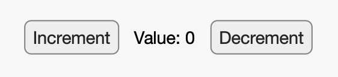
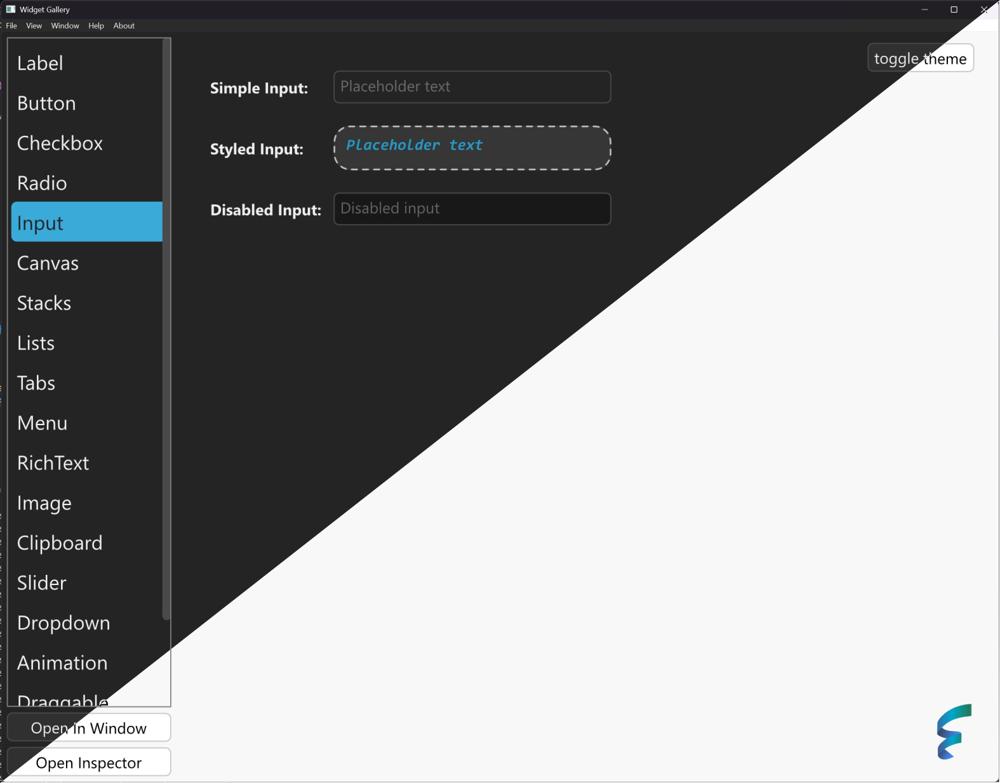

<div align="center">

# Floem

A native Rust UI library with fine-grained reactivity

[](https://crates.io/crates/floem)
[](https://docs.rs/floem)
[](https://discord.gg/RB6cRYerXX)

</div>

_The project is still maturing. We will make occasional breaking changes and add missing features on our way to v1._

## Quickstart



```rust
use floem::{
    reactive::create_signal,
    views::{button, label, Decorators},
    IntoView,
};

fn app_view() -> impl IntoView {
    // Create a reactive signal with a counter value, defaulting to 0
    let (counter, mut set_counter) = create_signal(0);

    // Create a vertical layout
    (
        // The counter value updates automatically, thanks to reactivity
        label(move || format!("Value: {counter}")),
        // Create a horizontal layout
        (
            button("Increment").action(move || set_counter += 1),
            button("Decrement").action(move || set_counter -= 1),
        ),
    ).style(|s| s.flex_col())
}

fn main() {
    floem::launch(app_view);
}
```

## Features

Inspired by [Xilem](https://github.com/linebender/xilem), [Leptos](https://github.com/leptos-rs/leptos) and [rui](https://github.com/audulus/rui), Floem aims to be a high performance declarative UI library requiring minimal user effort.

- **Cross-platform support**: Supports Windows, macOS and Linux with rendering using [wgpu](https://github.com/gfx-rs/wgpu). In case a GPU is unavailable, a CPU renderer powered by [tiny-skia](https://github.com/RazrFalcon/tiny-skia) will be used.
- **Fine-grained reactivity**: The entire library is built around reactive primitives inspired by [leptos_reactive](https://crates.io/crates/leptos_reactive). The reactive "signals" allow you to keep your UI up-to-date with minimal effort, all while maintaining very high performance.
- **Performance**: The view tree is only run once, safeguarding you from accidentally creating a bottleneck in a view generation function that slows down your entire application. Floem also provides tools to help you write efficient UI code, such as a [virtual list](https://github.com/lapce/floem/tree/main/examples/virtual_list).
- **Flexbox layout**: Using [Taffy](https://crates.io/crates/taffy), the library provides the Flexbox (or Grid) layout system, which can be applied to any View node.
- **Customizable widgets**: Don't want the default look? You can change pretty much anything you want using the styling API, or install a third-party theme.
- **Element inspector**: Inspired by your browser's developer tools, Floem provides a [diagnostic tool](https://lapce.dev/floem/floem/id/struct.Id.html#method.inspect) to debug your layout.

To sample Floem's capabilities, check out the repo and run the [widget gallery](examples/widget-gallery/src/main.rs) example with cargo.



To help you master Floem, we provide [documentation](https://docs.rs/floem) and [code examples](examples/).

## Contributions

[Contributions welcome!](CONTRIBUTING.md) If you'd like to improve how Floem works and fix things, feel free to open an issue or submit a PR. If you'd like a conversation with Floem devs, you can join in the #floem channel on this [Discord](https://discord.gg/RB6cRYerXX).
