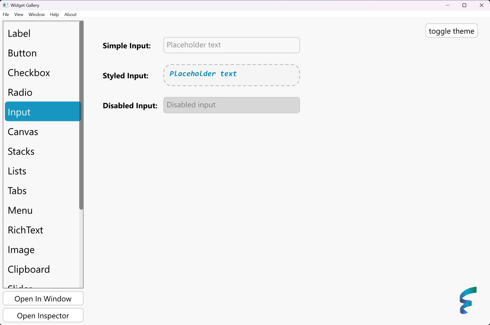

<div align="center">
</img>


# Floem

A native Rust UI library with fine-grained reactivity and great ergonomics

[](https://crates.io/crates/floem)
[](https://docs.rs/floem)
[](https://discord.gg/RB6cRYerXX)

</div>

_The project is still maturing. We will make occasional breaking changes and add missing features on our way to v1._

## Quickstart

```rust
use floem::prelude::*;

fn main() {
    floem::launch(counter_view);
}

fn counter_view() -> impl IntoView {
    let mut counter = RwSignal::new(0);

    h_stack((
        button("Increment").action(move || counter += 1),
        label(move || format!("Value: {counter}")),
        button("Decrement").action(move || counter -= 1),
    ))
    .style(|s| s.size_full().items_center().justify_center().gap(10))
}

```


## Features

Inspired by [Xilem](https://github.com/linebender/xilem), [Leptos](https://github.com/leptos-rs/leptos) and [rui](https://github.com/audulus/rui), Floem aims to be a high performance declarative UI library with a highly ergonomic API.

- **Cross-platform**: Floem supports Windows, macOS and Linux with rendering using [wgpu](https://github.com/gfx-rs/wgpu) via [vger](https://github.com/audulus/vger-rs) or [vello](https://github.com/linebender/xilem). In case a GPU is unavailable, a CPU renderer powered by [tiny-skia](https://github.com/RazrFalcon/tiny-skia) will be used.
- **Fine-grained reactivity**: The entire library is built around reactive primitives inspired by [leptos_reactive](https://crates.io/crates/leptos_reactive). The reactive "signals" allow you to keep your UI up-to-date with minimal effort, all while maintaining very high performance.
- **Performance**: The view tree is constructed only once, safeguarding you from accidentally creating a bottleneck in a view generation function that slows down your entire application. Floem also provides tools to help you write efficient UI code, such as a [virtual list](https://github.com/lapce/floem/tree/main/examples/virtual_list).
- **Flexbox & Grid layout**: Using [Taffy](https://crates.io/crates/taffy), the library provides the Flexbox and Grid layout systems, which can be applied to any View node.
- **Customizable widgets**: Widgets are highly customizable. You can customize both the appearance and behavior of widgets using the styling API, which supports theming with classes. You can also install third-party themes.
- **Transitions and Animations**: Floem supports both transitions and animations. Transitions, like css transitions, can animate any property that can be interpolated and can be applied alongside other styles, including in classes.

        Floem also supports full keyframe animations that build on the ergonomics of the style system. In both transitions and animations, Floem supports easing with spring functions.
- **Element inspector**: Inspired by your browser's developer tools, Floem provides a [diagnostic tool](docs/img/inspector.png) to debug your layout.
- **Global themes**: Support for light and dark themes, built in design system to easly delare your own
- **Localization**: Floem supports localizations via [Fluent](https://github.com/projectfluent/fluent-rs) crate with support for fallbacks, easy switching languages on runtime or even overriding active language for chosen part of you app

To sample Floem's capabilities, check out the repo and run the [widget gallery](examples/widget-gallery/src/main.rs) example with cargo.


<details>
    <summary>Light Mode</summary>


</details>


To help you master Floem, we provide [documentation](https://docs.rs/floem) and [code examples](examples/).

## Contributions

<a href="https://ws.lap.dev/#https://github.com/lapce/floem" target="_blank">
      
</a>

[Lapdev](https://lap.dev/), developed by the Lapce team, is a cloud dev env service similar to GitHub Codespaces. By clicking the button above, you'll be taken to a fully set up Floem dev env where you can browse the code and start developing. All dependencies are pre-installed, so you can get straight to code.

[Contributions welcome!](CONTRIBUTING.md) If you'd like to improve how Floem works and fix things, feel free to open an issue or submit a PR. If you'd like a conversation with Floem devs, you can join in the #floem channel on this [Discord](https://discord.gg/RB6cRYerXX).
